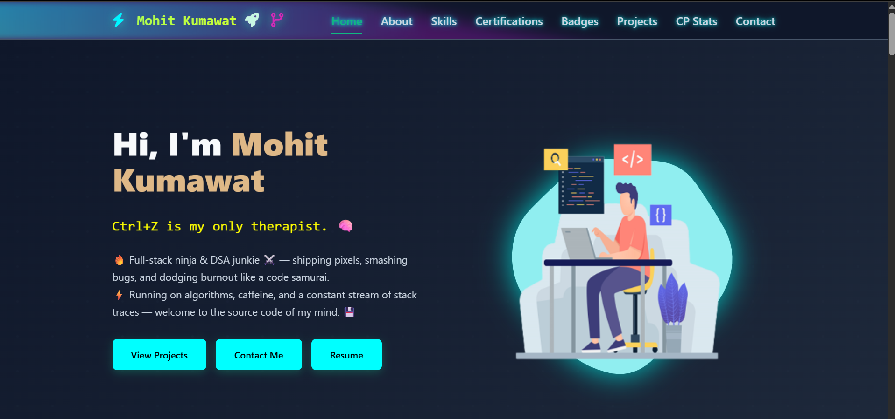
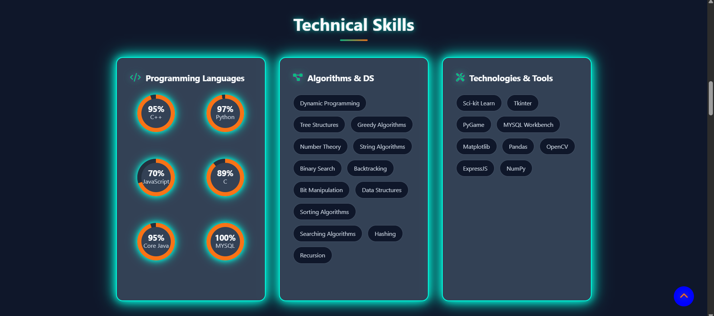
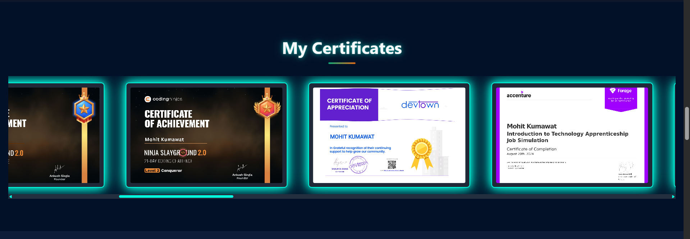
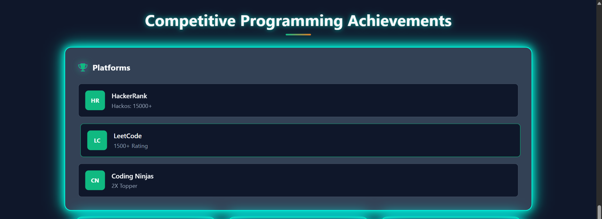
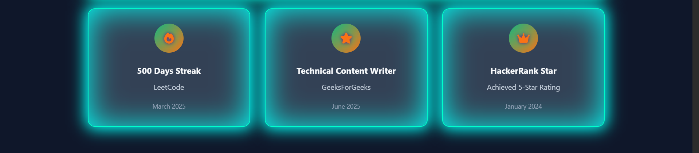
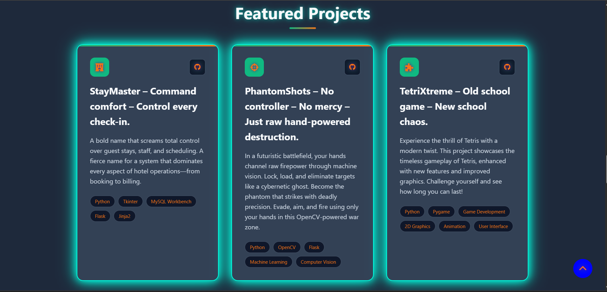
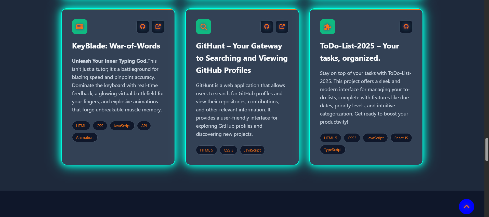
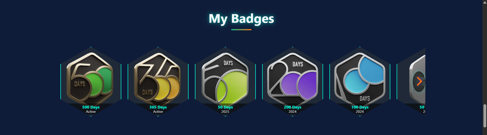
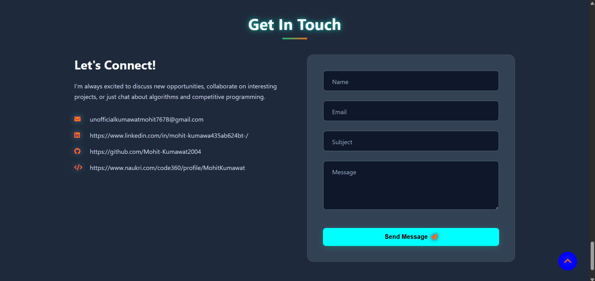

# ⚔️ Mohit Kumawat — Digital Warrior

> 🚨 *This ain’t just a portfolio. It’s a battlefield of code, caffeine, and chaos.*

---

## 🧠 Who TF Am I?

I'm **Mohit**, and I don’t just *write code* — I **launch digital weapons**.  
From gesture-controlled games to full-stack apps, if it's got logic, pixels, or power — I own it.

---

## 🔥 Tech Stack? I Call It My Arsenal

| 🧠 Languages | 🛠️ Frameworks        | ⚙️ Tools             | 🧩 Skills               |
|-------------|----------------------|----------------------|-------------------------|
| Python      | React                | Git                  | Fast Debugger           |
| JavaScript  | Node                 | Firebase             | UI Freak                |
| C++         | Flask                | MongoDB              | API Hunter              |
| Bash        | Django, OpenCV       | Postman              |                         |

---

## 💣 Battle-Tested Projects

### 🎮 **Gesture Shooter**
> Raise your hand. Fire like a beast.  
> Built with Python + OpenCV — **No controller, just chaos.**

### 🧠 **GitHub Profile Finder**
> Stalk devs like a pro. View heatmaps, stats & flex UI.  
> Tech: React + GitHub API

### 🚀 **Portfolio Site**
> Sleek, smooth, and sharp — like a katana made of CSS.

---

## 📸 Screenshot Mode: ON

*UI so clean it looks like it writes its own code.*

---

## 🧾 Real Talk

> “While you debug errors… I debug reality.”  
> – Probably me, while sipping coffee at 3AM

---

## 🕸️ Links That Matter

- 🔗 [Portfolio Live](https://your-portfolio-link.com)  
- 🐙 [GitHub](https://github.com/yourusername)  
- 💼 [LinkedIn](https://linkedin.com/in/yourprofile)

---

## ⚡ The Footer of Fury

> © 2025 Mohit Kumawat • Built with 🔥, sweat & sleepless nights  
> *Deploying vibes. One repo at a time.*

